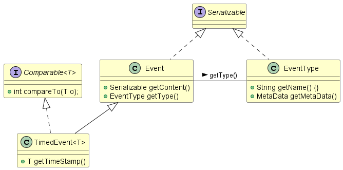

# Event package

## The publish-subscribe mechanism

There are two ways of communication between objects in object-oriented programming languages. According to Booch et al. (1999, Chapter 20):

* **Synchronous communication** implies that the invoker of a communication requests receives an immediate response. Method calls are generally synchronous events, representing the invocation of an operation. When we code: `double y = Math.sin(x)`, the call to the sine-operation is executed immediately. The thread in which the call to `sin(x)` is executed _blocks_ until the request has been completed, and an answer can be returned.
* **Asynchronous communication** implies that an answer to a call is not immediately requested. An example is the display of a web page with a button, where a user may or may not press the button, or even press it multiple times. In order to get the response from the button, we could _poll_ every millisecond to see if the button was pressed. Apart from this not being very efficient, this will also go wrong when the button is pressed twice in a millisecond interval, or when the user cancels the web page. For this situation, asynchronous communication is a much better solution. The web page registers a place to 'call back' the original thread of execution. When the button is pressed, the web page sends an _Event_ to that callback method, and it can be processed accordingly. Sometimes sending the Event is again an asynchronous message; sometimes it is synchronous (the latter is the case in the event mechanism in DJUTILS).

Asynchronous communication enables _loose coupling_ between objects. The fact an answer is not immediately requested is sometimes also called 'send-and-forget': maybe an answer to the request comes, maybe not. Either one is okay.


## Publish-subscribe mechanism in DJUTILS

The event mchanism that is present in DJUTILS is the so-called **publish-subscribe** mechanism using **strongly typed** events. Classes that implement the **EventListener** interface subscribe to certain events (corresponding to a certain **EventType**) of an **EventProducer**. In a sense, the pub-sub relationship implements the following: "In case 'X' happens in the event producing part of the model or system, please inform all subscribed event listeners using EventTypeX". 

The relation between the different classes for the `Event` and the methods per class are shown in the class diagram below:



In DJUTILS, event listeners are obliged to implement the `EventListener` interface The `notify` method specified in this interface ensures the required **callback** method for event producers on future state changes. The interface extends the `java.util.EventListener` interface which is a tagging interface that all event listener interfaces must extend (Arnold et al., 2000). The argument passed in the notify method is an instance of `Event`. DJUTILS provides two reference implementations of this Event: a basic `Event` class and a specialized `TimedEvent` class containing a time stamp, which is used for time based (e.g., statistical) computations. Every `Event` consists of a content attribute and a type; the Event is Serializable, so it can be transported over a network. The `EventType` class is used to uniquely identify a type of event.

!!! Note
    that although the `Event` is serializable, the programmer has to take care that each field of the Event 
    itself is serializable as well.

!!! Warning
    when using remote events over the network, or storing events in a database, make sure that the content of the 
    event is simple, in the sense that it does not contain pointers to objects that should not be serialized. 
    There have been examples in simulation where the entire state of a complex model was transmitted with each event...


The `EventProducer` interface and its reference implementation named `LocalEventProducer` have the `addListener` as the most important method. In a sense, with the `addListener` method you ask the `EventProducer` to add you (or another object) as a subscriber to the `EventType` mentioned in the `addListener` call. 

!!! Warning
    The djutils event package strongly changed in version 2.1.0, with non-upward compatible changes. The sourceId was removed
    from Event and from EventProducer. The interfaces for Event, EventProducer, TimedEvent, RemoteEventProducer and 
    RemoteEventListener were removed, as well as the AbstractEventType and AbstractEvent. The EventProducer implementation 
    was renamed to LocalEventProducer, and the remote event producers and listeners were renamed to RmiEventProducer and 
    RmiEventListener. See the release notes for v2.1.0 on Github.

!!! Note
    Note that the DJUTILS event package was originally part of [DSOL](https://simulation.tudelft.nl/dsol/manual) 
    (see [https://simulation.tudelft.nl/dsol/manual/advanced/pub-sub](https://simulation.tudelft.nl/dsol/manual/advanced/pub-sub)
    for more information). Because the Event package's use was much broader than DSOL, it has been placed 
    in DJUTILS.


## Example implementation: EventType

The construction of an `EventType` is using `MetaData` to ensure that the event contains the right payload when it is fired:

```java
public static final EventType THRESHOLD_REACHED_EVENT =
    new EventType(new MetaData("THRESHOLD_REACHED", "Threshold reached", 
        new ObjectDescriptor("pressure", "Pressure reached", Double.class)));
```

Usually EventTypes are declared as `public static final`, so they are immutable and can be used from any other class, but other use-cases exist as well. Note that the payload is indicated as a `Double` class, rather than a `double` class. The `Double` definition will allow both a Double and a double as payload for the event. So always specify the class rather than the primitive in the `MetaData` for an `EventType`.  


## Example implementation: EventProducer

Usually, a class extends the `LocalEventProducer` when it needs to be able to produce events, or alternatively implement the `EventProducer` interface, and embeds a `LocalEventProducer` (or, e.g., an `RmiEventProducer`). An event producing class notifies its subscribers of the event with the `fireEvent` method. Suppose we have a model called `PlantModel` that fires events (repeatedly) if the pressure in a reactor exceeds a threshold. An example of the code is shown below:

```java
public class PlantModel extends LocalEventProducer
{
    private double pressure;
    private double threshold;

    public void updatePressure()
    {
        ...
        if (this.pressure > this.threshold)
        {
            fireEvent(THRESHOLD_REACHED_EVENT, this.pressure);
        }
        ...
    }
```

The `fireEvent` method constructs an `Event` and transmits it to all the subscribers. An `Event` contains an `EventType` plus an optional payload. The eventType is `THRESHOLD_REACHED_EVENT`. The 'payload' of this event is a Double, with the current pressure as its value. Any `Serializable` Object can serve as the payload of an `Event`. The `fireEvent(eventType, double)` method is in essence the same as:

```java
Event event = new Event(THRESHOLD_REACHED_EVENT, 
    Double.valueOf(this.pressure));
fireEvent(event);
```

This example code will emit `THRESHOLD_REACHED_EVENT` each time the `updatePressure` method is executed as long as the pressure is above the threshold.


## Example implementation: EventListener

In order to receive notifications, the class implementing the `EventListener` interface must first register itself (or be registered by another class) at the `EventProducer` so it can be added to the subscribers' list. Registration is done with the `addListener` method on the `EventProducer`. Suppose we are a user interface that has to set a red warning indicator when the value of 'pressure' goes above the threshold in the model. The registration is done as follows:

```java
public class PlantUserInterface extends JFrame implements EventListener
{
    public PlantUserInterface(final PlantModel model)
    {
      model.addListener(this, PlantModel.THRESHOLD_REACHED_EVENT);
        // 'this' means that we register ourselves to the event of PlantModel
    }
}
```

It is also possible to have an external class (or even the main method) register the listener. The last statement in the example below reads as: "the _model_  gets the _ui_  object as an extra listener for the <i>THRESHOLD_REACHED_EVENT</i>  event":

```java
public static void main(final String[] args)
{
    PlantModel model = new PlantModel();
    PlantUserInterface ui = new PlantUserInterface(model);
    model.addListener(ui, PlantModel.THRESHOLD_REACHED_EVENT);
    ...
}
```

The `EventListener` interface still needs to implement the callback method. For the `EventListener` the callback method is called `notify(Event event)`. The callback method can be implemented as follows in the `PlantUserInterface` class:

```java
public void notify(final Event event)
{
    if (event.getType().equals(PlantModel.THRESHOLD_REACHED_EVENT)
        setRedWarning(((Double) event.getContent()).doubleValue());
    else
        System.err.println("Unknown event received: " + event);
}
```

The `setRedWarning` method uses the `Double` payload of the event that was received. Now, whenever the pressure in the model passes the threshold, the UserInterface is notified and the red warning is shown.

The rather obvious problem with this implementation is that nothing is shown while the pressure does not exceed the threshold. Once the pressure exceeds the threshold, the warning is shown and will remain shown; even if the pressure subsequently drops below the threshold. A more practical implementation would use an additional event to cancel the alarm when the pressure drops below the threshold, or regularly transmit a different kind of event while the pressure is below the threshold.


## The TimedEvent

As special class of events are the TimedEvents. A `TimedEvent` is an event with one extra field: a `timestamp`. Anything that is comparable can act as a timestamp. Often, `Time`, `Duration`, `Calendar`, `Number`, `Long` or `Double` are used for timestamping. The `EventProducer` has a number of implementations of an extra method called `fireTimedEvent` that creates a `TimedEvent` rather than a normal `Event` for the notification of the listeners. For the above example in `PlantModel`, this would look as follows:

```java
public static final TimedEventType THRESHOLD_TIME_EVENT =
    new TimedEventType(new MetaData("THRESHOLD_TIME", "Threshold reached", 
        new ObjectDescriptor("pressure", "Pressure reached", Double.class)));
...
  if (this.pressure > this.threshold)
    fireTimedEvent(THRESHOLD_TIME_EVENT, this.pressure,
      System.getCurrentTimeMillis());
```

In the `notify` method in the `PlantUserInterface` class, the timestamp can be requested as follows:

```java
public void notify(final Event event)
{
    if (event instanceof TimedEvent)
    {
        TimedEvent timedEvent = (TimedEvent) event;
        if (timedEvent.getType().equals(PlantModel.THRESHOLD_TIME_EVENT)
        {
            setRedWarning(((Double) timedEvent.getContent()).doubleValue());
            setWarningTime((Long) timedEvent.getTimestamp());
        }
        else
            System.err.println("Unknown event received: " + timedEvent);
    }
    else
        System.err.println("Expected TimedEvent but got: " + event);
}
```


## Use of WeakReference and StrongReference

When the subscribers or producers of events can 'disappear', which is for instance the case with parts of the program that can be closed by users, the use of normal pointers is not recommended. When a pointer from the `EventProducer` to the `EventListener` exists for a subscription, Java's garbage collector cannot reclaim the memory of the listener class, because there is still a pointer from the `EventProducer` to the (closed) `EventListener`. Even worse, the (no longer active) `EventListener` will keep receiving updates from the `EventProducer`, although it has been inactivated by the user. For this purpose, the `EventProducer` supports the so-called `WeakReference`. When an object only has weak references pointing to it, it can be cleared by the garbage collector. The notification method of the `EventProducer` will sense when the `EventListener` has been cleaned by the garbage collector, and it will cancel the subscription (using the `removeListener` method). 

By default (when nothing is specified) a `StrongReference` is used in the `addListener` method. When building interactive or networked applications where Listeners may 'disappear', the use of WeakReferences is recommended. 


## Remote event communication using RMI

To support the publish/subscribe mechanism between software running on different computers, the `RmiEventListener` and `RmiEventProducer` have been implemented. These use RMI (Remote Method Invocation) to call the `addListener` method on the remote `EventProducer`, and the `notify` method from the `EventProducer` on the remote `EventListener`.


## References

* Arnold, K., Gosling, J., and Holmes, D. (2000). The Java&trade; programming language. Addison-Wesley, Boston: MA, USA, 3rd edition.
* Booch, G., Rumbaugh, J., and Jacobson, I. (1999). _The Unified Modeling Language user guide_. Addison-Wesley, Indianapolis: IN, USA.

