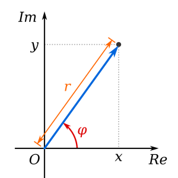

# Complex Numbers

Complex number augment the real number set with one additional dimension. In the complex number domain, one can represent the square root of a negative real number and many other things. Complex numbers are a mathematical concept that is used in many branches of physics. Complex numbers can be viewed in two main ways:

1. As a real component and an imaginary component.<br/>
2. As a norm (or radius, or absolute value) and a phi (or phase, or angle).

 <br/>(image from Wikipedia by Wolfkeeper at English Wikipedia.derivative work: Kan8eDie (talk) - Complex_number_illustration.svg, CC BY-SA 3.0)

The implementation of complex numbers in djutils internally stores a real and an imaginary component in a double. The norm and phi are available through methods, but the results of those methods are _not_ cached; access to those values is CPU intensive.

A complex number can be instantiated with a straighforward constructor:

```java
    Complex z1 = new Complex(123.456, -345.678);
    System.out.println(z1);
    Complex z2 = new Complex(543.210); // Create a complex with imaginary component 0.0
    System.out.println(z2);
```

When run, this outputs:

```text
Complex [re=123.456, im=-345.678]
Complex [re=543.21, im=0.0]
```

The real component can be directly accessed as the `re` field, or through the `getRe()` method. The imaginary component can be directly accessed as the `im` field, or through the `getIm()` method. The norm (or radius, or absolute value) can be obtained with the `norm()` method and the phi (or phase, or angle) with the `phi()` method:

```java
        Complex z = new Complex(123.456, -345.678);
        System.out.println("re=" + z.re + ", im=" + z.im + ", getRe:" + z.getRe() + ", getIm:" + z.getIm() + ", norm:"
                + z.norm() + ", phi:" + z.phi());
```
Outputs:

```text
re=123.456, im=-345.678, getRe:123.456, getIm:-345.678, norm:367.0622067443065, phi:-1.2277734859253564
```

As you might gather from this example, the value of phi is in radians.


## Complex constants

The Complex class defines a couple of useful constants: ZERO, ONE, MINUS_ONE, I and MINUS_I. The first three are the complex equivalents of the real numbers 0.0, 1.0 and -1.0. The last two are the imaginary unity (a.k.a. the principal square root of -1.0) and the negative, or complement thereof.

```java
    System.out.println("ZERO=" + Complex.ZERO);
    System.out.println("ONE=" + Complex.ONE);
    System.out.println("MINUS_ONE=" + Complex.MINUS_ONE);
    System.out.println("I=" + Complex.I);
    System.out.println("MINUS_I=" + Complex.MINUS_I);
```

Outputs:

```text
ZERO=Complex [re=0.0, im=0.0]
ONE=Complex [re=1.0, im=0.0]
MINUS_ONE=Complex [re=-1.0, im=0.0]
I=Complex [re=0.0, im=1.0]
MINUS_I=Complex [re=0.0, im=-1.0]
```


## Simple math with complex numbers

The complex numbers implement the usual binary operations for addition, subtraction, multiplication and division:

```java
    Complex z1 = new Complex(3, 4);
    Complex z2 = new Complex(-2, 5);
    System.out.println("z1=" + z1);
    System.out.println("z2=" + z2);
    System.out.println("z1 + z2=" + z1.plus(z2));
    System.out.println("z1 - z2=" + z1.minus(z2));
    System.out.println("z1 * z2=" + z1.times(z2));
    System.out.println("z1 / z2=" + z1.divideBy(z2));
    System.out.println("z1 * I=" + z1.times(Complex.I));
    System.out.println("I * I=" + Complex.I.times(Complex.I));
```

Outputs:

```text
z1=Complex [re=3.0, im=4.0]
z2=Complex [re=-2.0, im=5.0]
z1 + z2=Complex [re=1.0, im=9.0]
z1 - z2=Complex [re=5.0, im=-1.0]
z1 * z2=Complex [re=-26.0, im=7.0]
z1 / z2=Complex [re=0.48275862068965525, im=-0.7931034482758621]
z1 * I=Complex [re=-4.0, im=3.0]
I * I=Complex [re=-1.0, im=0.0]
```

The last line illustrates that the square of I is indeed the real number -1.0;

The [next page](complex-math)  documents more complex mathematical operations with `Complex` operands.